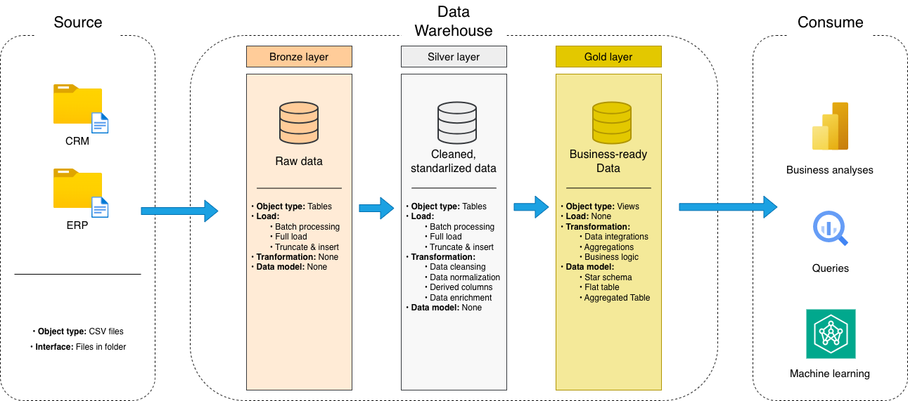
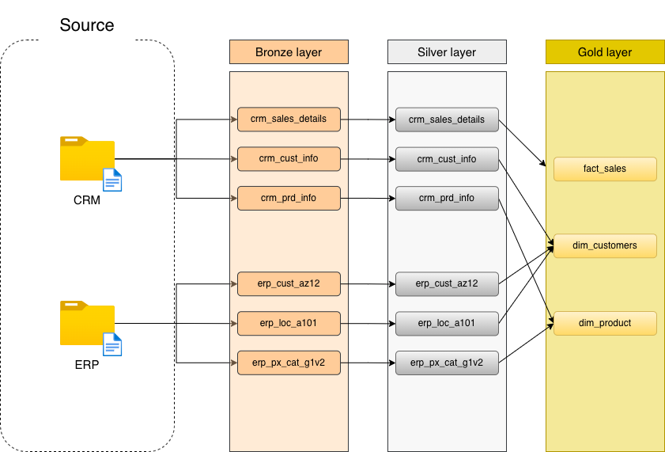

# 🏢 Data Warehouse Project - Medallion Architecture

Este projeto implementa um Data Warehouse completo utilizando **SQL Server**, estruturado na arquitetura de camadas utilizando o padrão de camadas Bronze → Silver → Gold (**Medalhão**), com o objetivo de organizar, limpar, padronizar e modelar dados provenientes de múltiplas fontes (CRM e ERP) para análise e suporte à tomada de decisão.

## 📐 Arquitetura do Projeto



A aquitetura do projeto foi feita da seguinte forma:

1.  **Camada Bronze (Raw)**: Armazena os dados brutos ingeridos diretamente dos arquivos CSV de origem. O processo utiliza `BULK INSERT` para carga rápida, preservando o formato original.
2.  **Camada Silver (Cleaned)**: Responsável pela limpeza e padronização.
    *   Principais tratamentos realizados:

        * Remoção de registros inválidos ou inconsistentes

        * Deduplicação com ROW_NUMBER()

        * Padronização de campos textuais (TRIM, UPPER)

        * Normalização de valores categóricos (gênero, status civil, país)

        * Conversão de tipos de dados (datas e valores numéricos)

        * Correção de métricas financeiras inconsistentes

        * Inclusão de coluna técnica dwt_create_date
3.  **Camada Gold (Curated)**: Modelagem dimensional (Star Schema) otimizada para ferramentas de BI (Power BI, Tableau).
    *   As views consolidam dados para análise de vendas, clientes e produtos.

O fluxo de dados foi desenhado para garantir rastreabilidade e qualidade em três etapas principais



## 📂 Estrutura de Arquivos

| Arquivo | Descrição |
| :--- | :--- |
| `init_db.sql` | Script de inicialização que cria o banco `DataWarehouse` e os schemas (`bronze`, `silver`, `gold`). |
| `bronze_definition.sql` | DDL para criação das tabelas da camada Bronze (recepção de dados brutos). |
| `bronze_insert.sql` | Procedure `bronze.load_bronze` que executa o `BULK INSERT` dos arquivos CSV. |
| `silver_definition.sql` | DDL para criação das tabelas da camada Silver (dados tipados e limpos). |
| `silver_insert.sql` | Procedure `silver.load_silver` contendo a lógica de transformação e carga (ETL). |
| `gold_definition.sql` | Criação das Views da camada Gold (`dim_customers`, `dim_products`, `fact_sales`). |

## 🚀 Como Executar

### Pré-requisitos
*   **SQL Server** (2019 ou superior)
*   Arquivos de dados (CSVs) das fontes CRM e ERP salvos localmente.

### Passo a Passo

1.  **Configuração do Ambiente**:
    Execute o script `init_db.sql` para criar o banco de dados e a estrutura de schemas.

2.  **Criação das Tabelas**:
    Execute os scripts de definição para criar as tabelas vazias:
    *   `bronze_definition.sql`
    *   `silver_definition.sql`

3.  **Execução do ETL**:
    Após configurar os caminhos, execute as procedures de carga na seguinte ordem:
    ```sql
    -- 1. Carrega dados brutos
    EXEC bronze.load_bronze;
    
    -- 2. Processa e limpa os dados
    EXEC silver.load_silver;
    ```

5.  **Camada Analítica**:
    Execute `gold_definition.sql` para criar as views finais de análise.

## 📊 Modelo de Dados (Gold Layer)

A camada final apresenta um modelo **Star Schema**:

*   **fact_sales**: Tabela fato central contendo métricas de vendas (valor, quantidade).
*   **dim_customers**: Dimensão unificada de clientes (CRM + ERP).
*   **dim_products**: Dimensão de produtos com histórico de categorias.

---
*Desenvolvido para fins acadêmicos e de portfólio.*